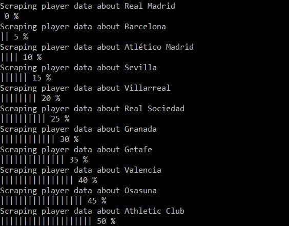
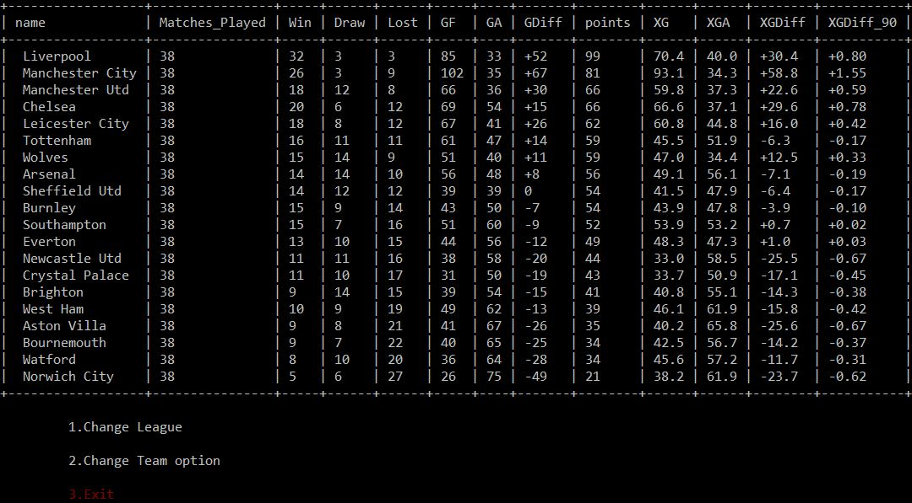
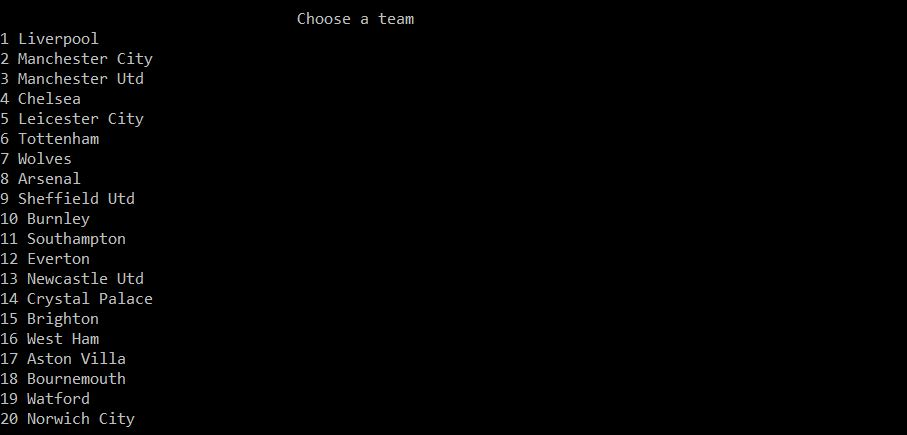
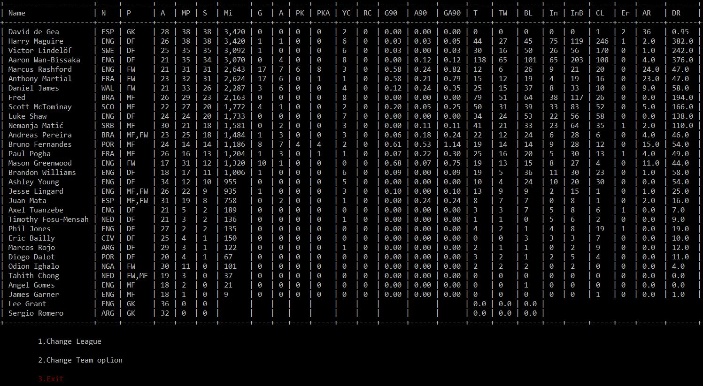
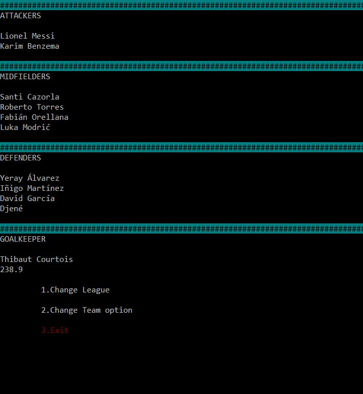

# Scrap League - Web Scraper for Football Data
> This is a Ruby Web scrapper Capstone Project which was made according to [this project specifications](https://www.notion.so/Build-your-own-scraper-f54eaca54d8a4d758a5f0141468127a8).

> In this project, football statistics Web Scraper program was built which allows users to get a complete list of information about 5 different leagues. The following stats are analyzed based on the scaped data: -

    - league standing
    - player stats
    - suggested best starting eleven
    - best attacker
    - best midfielder 
    - best defender  in the league.
> The suggestions regarding the best starting eleven and best players are not scraped values but are calculated in the appilcation based on the players performance. 

> The program creates a JSON file for all the stats for the user to use.
> It uses https://fbref.com/ to scrap all the required data.

## Sample Screenshot

### Scraping status and loading bar


### League table


### Team menu


### players table


### suggested best starting eleven team based on the data



## Built With

- Ruby
- Nokogiri gem
- open-uri
- colorize gem
- json gem
- terminal-table gem
- VScode

## Project Structure

```
├── bin
│   └── main.rb
└── docs
    └── clubs
    └── players
└── lib
    └── constants.rb
    └── file_handler.rb
    └── interface_data_control.rb
    └── parser.rb
    └── player_scraper.rb
    └── players_rating.rb
    └── show_status.rb
    └── team_scraper.rb
└── media
    └── readme1.JPG
    └── readme2.JPG
    └── readme3.JPG
    └── readme4.JPG
└── spec
    └── file_handler_spec.rb
    └── Interface_data_control_spec.rb
    └── player_rating_spec.rb
    └── player_scraper_spec.rb
    └── show_status_spec.rb
    └── spec_helper.rb
    └── team_scraper_spec.rb   
├── README.md
├── .rubocop.yml
├── Gemfile.lock
├── Gemfile
├── .rspec
```
## Prerequisites
1) Ruby
2) CLI basic knowledge
3) Install the gem in the gemfile

## Deployment
1) Git clone this repo and change the CLI directory to `Scrap_League-Web-Scraper`.
2) Run `bundle install` in command line to install Nokogiri and other Gems.
3) Run `bin/main.rb`.
4) Select the league you want to get data from and browse through the UI
5) Make sure to maximize your terminal window to view contents better.
6) You will get a JSON file of all the data scraped in the ./docs folder.

## Run tests
1) Git clone this repo and change the CLI directory to `Scrap_League-Web-Scraper`.
2) Install rspec with `gem install rspec`.
3) Run `rspec` in Command Line.

## Authors

👤 **Bereket Beshane**

- Github: [@berabjesus](https://github.com/Berabjesus)
- Twitter: [@bereket_ababu_b](https://twitter.com/bereket_ababu_b)
- Linkedin: [linkedin](https://www.linkedin.com/in/bereket-beshane-a1b75a1a9/)

## 🤝 Contributing

Contributions, issues and feature requests are welcome!

## Show your support

Give a ⭐️ if you like this project!

## Acknowledgments

- Microverse
- Nokogiri gem
-  https://fbref.com/ 

## 📝 License

This project is [MIT](LICENSE) licensed.
